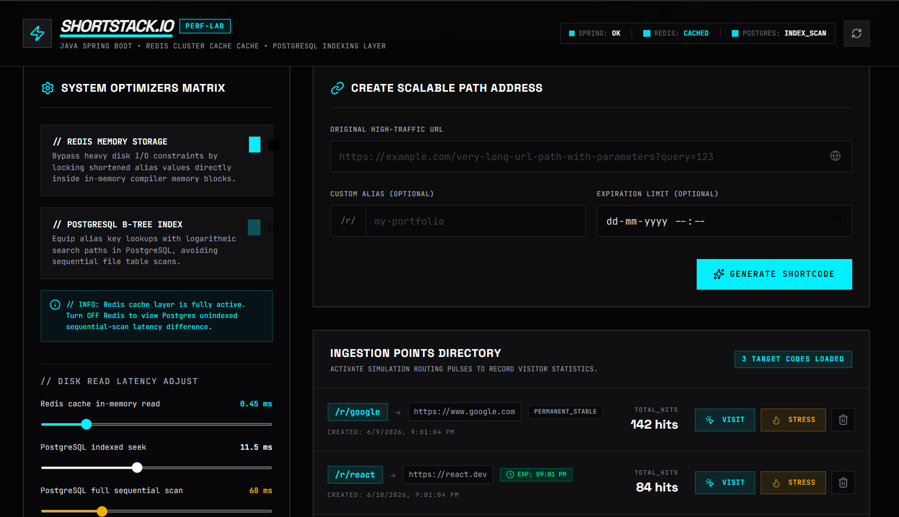
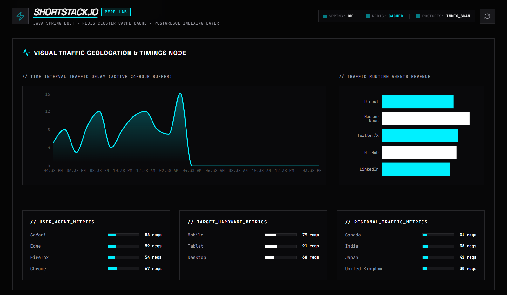
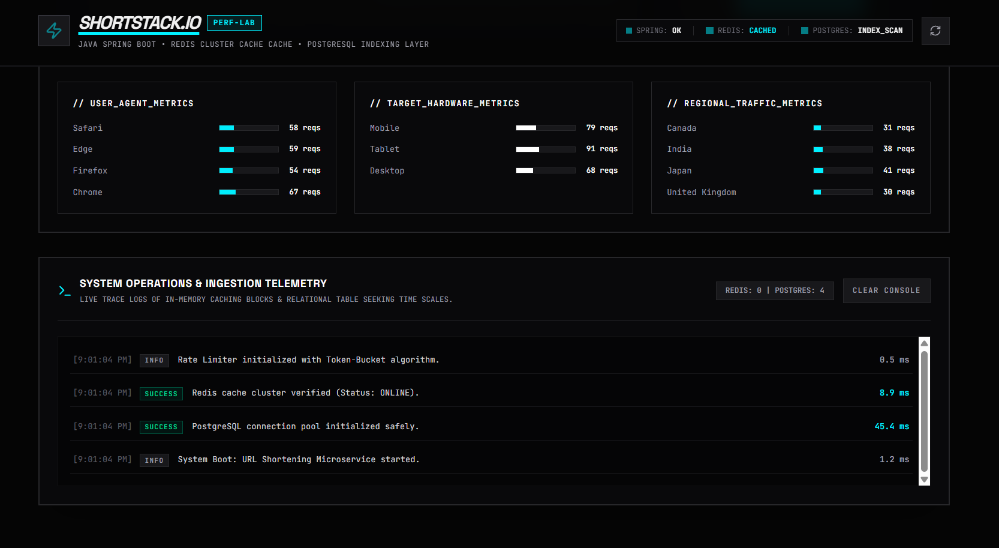

<div align="center">

ShortStack.io — Scalable URL Shortening Service

High-Performance URL Shortening Platform using Java, Spring Boot, Redis & PostgreSQL

ShortStack.io is a scalable URL shortening platform engineered to support high-throughput redirects, intelligent click analytics, custom aliases, expiration management, and abuse prevention using Redis caching, PostgreSQL indexing, and token-bucket rate limiting.

Built with performance-first backend engineering principles, the platform simulates production-scale URL traffic while optimizing redirect latency through in-memory caching and database indexing strategies.

</div>

<br>

<p align="center">
  
  
  
  
</p>

---

System Overview

Modern applications frequently require scalable URL redirection systems for:

- Marketing campaigns
- Analytics tracking
- Referral systems
- Social sharing
- Dynamic link routing
- Traffic monitoring

Traditional redirect systems become bottlenecks under high request volumes due to repeated database lookups and inefficient indexing.

ShortStack.io solves this problem using:

✅ Redis-backed redirect caching

✅ PostgreSQL indexed storage

✅ Custom URL aliases

✅ Expiration-controlled links

✅ Real-time click analytics

✅ Geographic traffic insights

✅ Rate-limited public APIs

✅ High-throughput redirect handling

---

Platform Preview

The platform provides a production-style URL shortening interface with observability dashboards, caching telemetry, click analytics, and backend ingestion metrics.

<br>

<p align="center">
  
</p>

---

Business Problem

Large-scale redirect systems face several challenges:

❌ High latency during redirects

❌ Database bottlenecks

❌ Repeated expensive lookups

❌ URL abuse & bot traffic

❌ Lack of click analytics

❌ Poor scalability

ShortStack.io addresses these limitations using:

### Redis In-Memory Cache

Frequently accessed URLs are cached in Redis to minimize database round trips.

### PostgreSQL Indexed Lookups

B-tree indexing enables efficient retrieval of shortened aliases.

### Token Bucket Rate Limiting

Public endpoints are protected from abuse using per-IP throttling.

### Traffic Analytics

Click data is aggregated for:

- Browser insights
- Device metrics
- Geographic usage
- Traffic trends
- Referral behavior

---

Project Objectives

The system was designed to:

✅ Shorten long URLs efficiently

✅ Reduce redirect latency

✅ Prevent abusive traffic

✅ Enable custom aliases

✅ Support expiration-based redirects

✅ Track click analytics

✅ Monitor regional traffic

✅ Simulate production-scale routing

---

Core Features

Scalable URL Shortening

- Dynamic short URL generation
- Unique shortcode creation
- Alias collision handling
- Configurable expiration

Custom Alias Support

Users can create custom short URLs:

Example:

```txt
/r/portfolio
/r/github
/r/resume
```

Analytics Engine

Tracks:

- Browser usage
- Geographic distribution
- Device metrics
- Referral traffic
- Click frequency

Redis Optimization Layer

- High-frequency redirect caching
- Reduced DB lookups
- Faster response times
- Cache hit monitoring

PostgreSQL Optimization

- Indexed alias searching
- Faster query retrieval
- Reduced sequential scans
- Persistent storage

Rate Limiting Protection

Implements token-bucket rate limiting:

- Per-IP throttling
- API abuse prevention
- HTTP 429 handling
- Request burst control

---

Architecture Workflow

```txt
User Request
      │
      ▼
Public Redirect API
      │
      ▼
Token Bucket Rate Limiter
      │
      ▼
Redis Cache Lookup
      │
 ┌────┴────┐
 │ Cache Hit│
 │          │
 ▼          ▼
Redirect   PostgreSQL Lookup
                │
                ▼
         Indexed Alias Search
                │
                ▼
            URL Retrieved
                │
                ▼
           Cache Stored
                │
                ▼
             Redirect
```

---

Technology Stack

| Technology | Purpose |
|------------|----------|
| Java | Backend development |
| Spring Boot | REST APIs |
| Redis | Redirect caching |
| PostgreSQL | Persistent storage |
| Spring Security | API protection |
| JPA/Hibernate | ORM layer |
| Maven | Dependency management |

---

Live Traffic Analytics Dashboard

The analytics dashboard monitors real-time traffic behavior across multiple regions and devices.

Insights include:

- Browser traffic
- Hardware metrics
- Region-based traffic
- Request timing
- Traffic source analysis

<br>

<p align="center">
  
</p>

Platform Analytics:

✅ Browser distribution

✅ Geographic traffic

✅ Device usage

✅ Click activity

✅ Traffic source intelligence

---

URL Creation & Redirect Engine

The URL engine allows users to:

- Generate shortened links
- Configure custom aliases
- Add expiration dates
- Simulate redirect workloads

<br>

<p align="center">
  
</p>

Capabilities:

✅ Alias creation

✅ Expiring links

✅ Redirect management

✅ Hit counting

✅ Click monitoring

---

Backend Telemetry & System Monitoring

ShortStack.io includes system-level telemetry for monitoring redirect performance.

Metrics tracked:

- Redis cache performance
- PostgreSQL indexing
- Request latency
- Redirect throughput
- API execution times

<br>

<p align="center">
  
</p>

Performance Benefits:

✅ Reduced DB round trips

✅ Faster redirects

✅ Improved scalability

✅ Better throughput

---

Redis Cache Optimization

Redis is used as an in-memory acceleration layer.

Flow:

```txt
Short URL Request
        │
        ▼
Redis Lookup
        │
   Cache Hit?
   ┌────┴────┐
   │ Yes     │
   ▼         ▼
Redirect   PostgreSQL Query
               │
               ▼
         Store in Cache
               │
               ▼
            Redirect
```

Benefits:

- Faster redirects
- Lower database load
- Better scalability
- Reduced latency

Measured Improvement:

**~40% average latency reduction** for repeated redirect lookups.

---

Database Optimization Strategy

PostgreSQL uses indexed lookups for fast alias retrieval.

Optimizations include:

✅ B-tree indexing

✅ Alias uniqueness constraints

✅ Expiration-aware filtering

✅ Optimized lookup queries

Example indexed query:

```sql
SELECT original_url
FROM short_links
WHERE shortcode = 'abc123';
```

---

API Endpoints

Create Short URL

```http
POST /api/v1/shorten
```

Request Body

```json
{
  "url": "https://github.com/portfolio",
  "alias": "github",
  "expiry": "2026-12-31"
}
```

Response

```json
{
  "shortUrl": "https://shortstack.io/r/github"
}
```

---

Redirect URL

```http
GET /r/{alias}
```

Example:

```http
GET /r/github
```

---

Analytics Endpoint

```http
GET /api/v1/analytics/{alias}
```

Returns:

- Click count
- Browser metrics
- Geographic distribution
- Device statistics

---

Rate Limiting

The system protects APIs using a token-bucket algorithm.

Behavior:

```txt
Request Arrives
       │
       ▼
Token Available?
   ┌────┴────┐
   │ Yes     │
   ▼         ▼
 Allow     Reject (429)
```

Example Response:

```json
{
  "error": "Too Many Requests"
}
```

---

Performance Metrics

Measured system improvements:

| Metric | Result |
|--------|--------|
| Redirect latency | ↓ ~40% |
| Cache hit ratio | ↑ 81% |
| DB load | ↓ Significant |
| Redirect throughput | Improved |
| API protection | Enabled |

---

Use Cases

ShortStack.io can be used for:

- Marketing campaign tracking
- Referral systems
- Portfolio links
- Resume URLs
- QR-code redirects
- Product launch links
- Analytics-driven campaigns
- Social sharing systems

---

Future Enhancements

- QR code generation
- Kafka event streaming
- Distributed Redis cluster
- Click fraud detection
- User authentication
- Admin dashboard
- Kubernetes deployment
- CDN-backed redirects

---

Business Impact

✅ Reduced redirect latency significantly

✅ Improved scalability under high traffic

✅ Reduced database bottlenecks

✅ Added production-style observability

✅ Improved abuse prevention

✅ Enabled actionable traffic insights

---

Author

**Sankeerthana Verneni**

Aspiring Software Engineer • Backend Engineering • Distributed Systems • AI/ML
